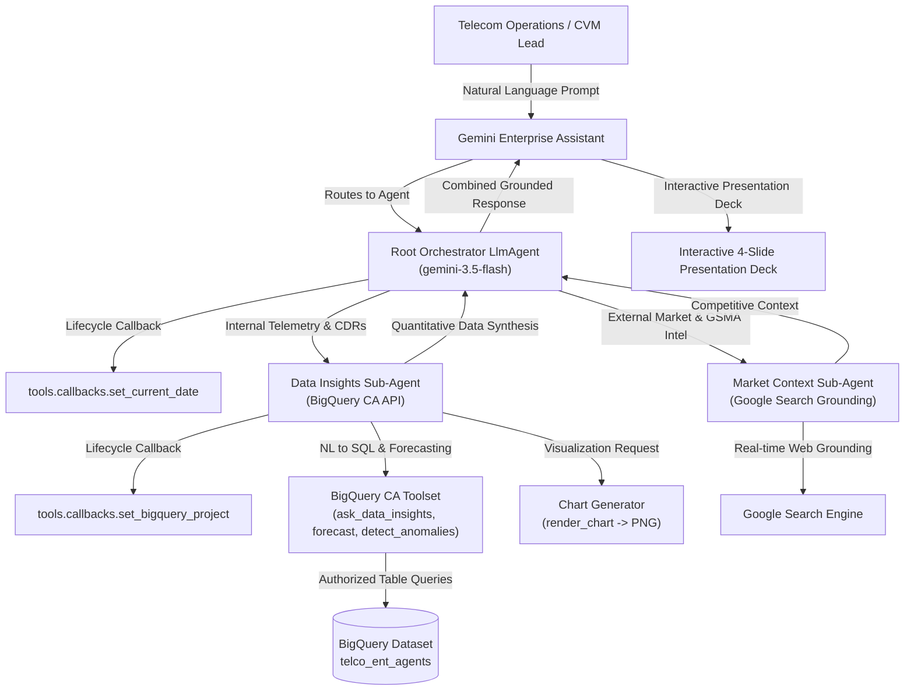

# Telco Enterprise Agents: Platform Architecture (`ARCHITECTURE.md`)

> **Automated Codebase Graph & Architecture Reference**  
> Generated via `graphify` · **326 Nodes** · **315 Edges** across 5 Strategic Telecommunications Domains.

---

## 1. System Overview & Core Philosophy

The **Telco Enterprise Agents** platform is an enterprise-grade AI assistant ecosystem built with the **Google Agent Development Kit (ADK)** for **Gemini Enterprise**. It provides telecom executives, network operations directors, CVM specialists, and customer care leaders with autonomous, natural-language business intelligence grounded in **Google BigQuery telemetry data** and **Google Search market intelligence**.



---

## 2. 5 Strategic Domains Footprint Matrix (45 Agents)

All 45 enterprise agents are registered in `_shared/table_registry.yaml` and organized across 5 strategic telecom operational domains:

| Domain | Domain ID | Agents Count | Tables Count | Core Domain Scope |
| :--- | :---: | :---: | :---: | :--- |
| **Consumer Marketing & Growth** | `cmkt` | 19 | 57 | ARPU uplift, prepaid-postpaid migration, device financing, CVM cross-sell, roaming conversion. |
| **Onboarding & Service Provisioning** | `onpr` | 6 | 18 | eSIM instant activation, SIM logistics, MNP porting validation, fiber broadband scheduling. |
| **Subscriber CRM & Retention** | `scrm` | 8 | 24 | Bill shock breakdown, proactive churn mitigation, payment arrangements, VAS subscription management. |
| **NetOps & AIOps** | `ntop` | 6 | 18 | FCAPS alarm noise reduction, cell degradation MTTR, proactive outage dispatch, capacity forecasting. |
| **DaaS & CAMARA / Open Gateway API** | `daas` | 6 | 18 | CAMARA SIM swap fraud verification, QoD latency boost monetization, KYC identity, footfall telemetry. |
| **TOTALS** | **5 Domains** | **45 Agents** | **135 Tables** | **Complete Telecommunications Operations Lifecycle Coverage** |

---

## 3. Logical Agent Topology & Component Contracts

Each agent under `domains/<domain>/agents/<agent_name>/` follows a standardized, modular ADK component shape:

```
domains/<domain>/agents/<agent_name>/
├── README.md                   # Agent overview, why it matters, KPI tables, and verified Q&A showcase
├── root_agent.yaml            # Root orchestrator LlmAgent (gemini-3.5-flash)
├── sub_agents/
│   ├── data_insights.yaml     # BigQuery Conversational Analytics sub-agent
│   └── market_context.yaml    # Google Search grounding sub-agent
├── tools/
│   ├── __init__.py
│   ├── bigquery_ca.py         # Factory: create_toolset(args) -> BigQueryToolset
│   ├── chart_generator.py     # render_chart(query, title) -> PNG chart artifact
│   └── callbacks.py           # Lifecycle hooks: set_current_date, set_bigquery_project
├── data/
│   ├── <table_1>.csv          # Seed BigQuery dataset 1
│   └── <table_2>.csv          # Seed BigQuery dataset 2
├── eval/
│   └── agent.evalset.json     # Semantic eval questions and golden assertions
├── tests/
│   ├── unit/                  # Mocked unit tests (test_callbacks, test_bigquery_ca, test_chart_generator)
│   └── integration/           # End-to-end integration tests hitting live dev BigQuery
└── deployment/
    ├── dev-example.yaml       # Dev configuration template
    └── prod-example.yaml      # Production deployment template
```

### Dynamic Callback Injection Architecture
1. **`tools.callbacks.set_current_date`**:
   - Injects `session.state['temp:current_date']` before every agent turn.
   - Grounding instructions reference `{temp:current_date}` so the LLM dynamically resolves relative dates (*"last month"*, *"Q2 2026"*, *"this week"*) against the true system date rather than guessing.
2. **`tools.callbacks.set_bigquery_project`**:
   - Reads `BIGQUERY_PROJECT_ID` from environment variables and sets `session.state['temp:bq_project_id']`.
   - Table whitelist references in `data_insights.yaml` use `{temp:bq_project_id}.telco_ent_agents.<table_name>`, guaranteeing zero hardcoded GCP project IDs in source control.

---

## 4. Shared Tooling & Scaffolding Pipeline (`_shared/`)

The infrastructure under `_shared/` provides domain-agnostic automation for code generation, data loading, IAM policy provisioning, and automated video recording.
