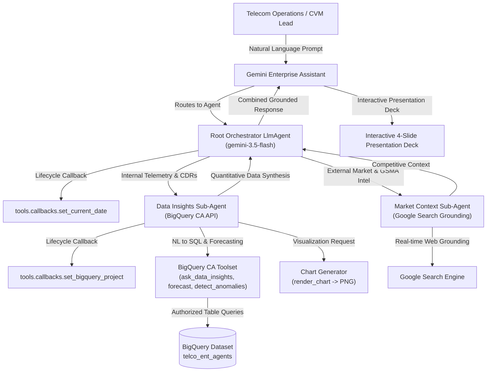

# Telco Enterprise Agents

Google Agent Development Kit (ADK) agents for Gemini Enterprise, organized by telecommunications domain.
Each agent answers operational and business questions by querying BigQuery through the Conversational Analytics
API, supplemented by Google Search grounding for external telecom market context and GSMA/3GPP specifications — defined declaratively
in YAML rather than as hand-written orchestration code.

---

## What's Built

> 💡 **Tip**: Click on any telecom domain accordion below to collapse/expand its deployed agent roster, links, and KPI focus.

<details open>
<summary><b>📱 Consumer Marketing & Growth (19 of 19 Agents Deployed)</b></summary>
<br/>

> **Domain Scope**: Prepaid-to-postpaid migration, family plan upsell, 5G device upgrades, CVM retention, Roaming pass conversion, churn deflection, OTT streaming bundles, student/senior tiering, SIM-only acquisition, and real-time data boost.

| No. | Gemini Enterprise Agent | Demo | Focus of Agent |
| :--- | :--- | :---: | :--- |
| 1 | [Family Plan Upsell](domains/consumer_marketing/agents/family_plan_upsell/README.md) | <a href="https://ryanwjh.github.io/telco-enterprise-agents/demos/gemini-enterprise/consumer_marketing/family_plan_upsell.html" target="_blank" rel="noopener noreferrer">🎬 Demo</a> | Telecom operational intelligence for family plan upsell, monitoring internal `cmkt_famu_*` telemetry and market benchmarks. |
| 2 | [Retail Store Placement](domains/consumer_marketing/agents/retail_store_placement/README.md) | <a href="https://ryanwjh.github.io/telco-enterprise-agents/demos/gemini-enterprise/consumer_marketing/retail_store_placement.html" target="_blank" rel="noopener noreferrer">🎬 Demo</a> | Telecom operational intelligence for retail store placement, monitoring internal `cmkt_rtsp_*` telemetry and market benchmarks. |
| 3 | [5G Handset Upgrade](domains/consumer_marketing/agents/five_g_handset_upgrade/README.md) | <a href="https://ryanwjh.github.io/telco-enterprise-agents/demos/gemini-enterprise/consumer_marketing/five_g_handset_upgrade.html" target="_blank" rel="noopener noreferrer">🎬 Demo</a> | Telecom operational intelligence for 5g handset upgrade, monitoring internal `cmkt_fghu_*` telemetry and market benchmarks. |
| 4 | [VoLTE Compliance & Grey Market](domains/consumer_marketing/agents/volte_compliance_grey_market/README.md) | <a href="https://ryanwjh.github.io/telco-enterprise-agents/demos/gemini-enterprise/consumer_marketing/volte_compliance_grey_market.html" target="_blank" rel="noopener noreferrer">🎬 Demo</a> | Telecom operational intelligence for volte compliance & grey market, monitoring internal `cmkt_vcgm_*` telemetry and market benchmarks. |
| 5 | [International Call Pack](domains/consumer_marketing/agents/international_call_pack/README.md) | <a href="https://ryanwjh.github.io/telco-enterprise-agents/demos/gemini-enterprise/consumer_marketing/international_call_pack.html" target="_blank" rel="noopener noreferrer">🎬 Demo</a> | Telecom operational intelligence for international call pack, monitoring internal `cmkt_icpk_*` telemetry and market benchmarks. |
| 6 | [Cloud Storage Upsell](domains/consumer_marketing/agents/cloud_storage_upsell/README.md) | <a href="https://ryanwjh.github.io/telco-enterprise-agents/demos/gemini-enterprise/consumer_marketing/cloud_storage_upsell.html" target="_blank" rel="noopener noreferrer">🎬 Demo</a> | Telecom operational intelligence for cloud storage upsell, monitoring internal `cmkt_cstu_*` telemetry and market benchmarks. |
| 7 | [Tourist Welcome & Roaming](domains/consumer_marketing/agents/tourist_welcome_roaming/README.md) | <a href="https://ryanwjh.github.io/telco-enterprise-agents/demos/gemini-enterprise/consumer_marketing/tourist_welcome_roaming.html" target="_blank" rel="noopener noreferrer">🎬 Demo</a> | Telecom operational intelligence for tourist welcome & roaming, monitoring internal `cmkt_twro_*` telemetry and market benchmarks. |
| 8 | [Self-Serve Device Specs](domains/consumer_marketing/agents/self_serve_device_specs/README.md) | <a href="https://ryanwjh.github.io/telco-enterprise-agents/demos/gemini-enterprise/consumer_marketing/self_serve_device_specs.html" target="_blank" rel="noopener noreferrer">🎬 Demo</a> | Telecom operational intelligence for self-serve device specs, monitoring internal `cmkt_ssds_*` telemetry and market benchmarks. |
| 9 | [5G Home Broadband Upsell](domains/consumer_marketing/agents/five_g_home_broadband_upsell/README.md) | <a href="https://ryanwjh.github.io/telco-enterprise-agents/demos/gemini-enterprise/consumer_marketing/five_g_home_broadband_upsell.html" target="_blank" rel="noopener noreferrer">🎬 Demo</a> | Telecom operational intelligence for 5g home broadband upsell, monitoring internal `cmkt_fghb_*` telemetry and market benchmarks. |
| 10 | [In-the-Moment Data Boost](domains/consumer_marketing/agents/in_the_moment_data_boost/README.md) | <a href="https://ryanwjh.github.io/telco-enterprise-agents/demos/gemini-enterprise/consumer_marketing/in_the_moment_data_boost.html" target="_blank" rel="noopener noreferrer">🎬 Demo</a> | Telecom operational intelligence for in-the-moment data boost, monitoring internal `cmkt_imdb_*` telemetry and market benchmarks. |
| 11 | [5G Gaming QoS Package](domains/consumer_marketing/agents/five_g_gaming_qos_package/README.md) | <a href="https://ryanwjh.github.io/telco-enterprise-agents/demos/gemini-enterprise/consumer_marketing/five_g_gaming_qos_package.html" target="_blank" rel="noopener noreferrer">🎬 Demo</a> | Telecom operational intelligence for 5g gaming qos package, monitoring internal `cmkt_fgqp_*` telemetry and market benchmarks. |
| 12 | [Airport Roaming Pass](domains/consumer_marketing/agents/airport_roaming_pass/README.md) | <a href="https://ryanwjh.github.io/telco-enterprise-agents/demos/gemini-enterprise/consumer_marketing/airport_roaming_pass.html" target="_blank" rel="noopener noreferrer">🎬 Demo</a> | Telecom operational intelligence for airport roaming pass, monitoring internal `cmkt_arps_*` telemetry and market benchmarks. |
| 13 | [Competitor Churn Insights](domains/consumer_marketing/agents/competitor_churn_insights/README.md) | <a href="https://ryanwjh.github.io/telco-enterprise-agents/demos/gemini-enterprise/consumer_marketing/competitor_churn_insights.html" target="_blank" rel="noopener noreferrer">🎬 Demo</a> | Telecom operational intelligence for competitor churn insights, monitoring internal `cmkt_cpci_*` telemetry and market benchmarks. |
| 14 | [Prepaid to Postpaid](domains/consumer_marketing/agents/prepaid_to_postpaid/README.md) | <a href="https://ryanwjh.github.io/telco-enterprise-agents/demos/gemini-enterprise/consumer_marketing/prepaid_to_postpaid.html" target="_blank" rel="noopener noreferrer">🎬 Demo</a> | Telecom operational intelligence for prepaid to postpaid, monitoring internal `cmkt_prpo_*` telemetry and market benchmarks. |
| 15 | [Streaming SubHub Bundles](domains/consumer_marketing/agents/streaming_subhub_bundles/README.md) | <a href="https://ryanwjh.github.io/telco-enterprise-agents/demos/gemini-enterprise/consumer_marketing/streaming_subhub_bundles.html" target="_blank" rel="noopener noreferrer">🎬 Demo</a> | Telecom operational intelligence for streaming subhub bundles, monitoring internal `cmkt_sshb_*` telemetry and market benchmarks. |
| 16 | [Smartwatch OneNumber eSIM](domains/consumer_marketing/agents/smartwatch_onenumber_esim/README.md) | <a href="https://ryanwjh.github.io/telco-enterprise-agents/demos/gemini-enterprise/consumer_marketing/smartwatch_onenumber_esim.html" target="_blank" rel="noopener noreferrer">🎬 Demo</a> | Telecom operational intelligence for smartwatch onenumber esim, monitoring internal `cmkt_swoe_*` telemetry and market benchmarks. |
| 17 | [Work-From-Home Broadband](domains/consumer_marketing/agents/work_from_home_broadband/README.md) | <a href="https://ryanwjh.github.io/telco-enterprise-agents/demos/gemini-enterprise/consumer_marketing/work_from_home_broadband.html" target="_blank" rel="noopener noreferrer">🎬 Demo</a> | Telecom operational intelligence for work-from-home broadband, monitoring internal `cmkt_wfmb_*` telemetry and market benchmarks. |
| 18 | [Social Media Pass](domains/consumer_marketing/agents/social_media_pass/README.md) | <a href="https://ryanwjh.github.io/telco-enterprise-agents/demos/gemini-enterprise/consumer_marketing/social_media_pass.html" target="_blank" rel="noopener noreferrer">🎬 Demo</a> | Telecom operational intelligence for social media pass, monitoring internal `cmkt_smpk_*` telemetry and market benchmarks. |
| 19 | [Secondary Tablet SIM](domains/consumer_marketing/agents/secondary_tablet_sim/README.md) | <a href="https://ryanwjh.github.io/telco-enterprise-agents/demos/gemini-enterprise/consumer_marketing/secondary_tablet_sim.html" target="_blank" rel="noopener noreferrer">🎬 Demo</a> | Telecom operational intelligence for secondary tablet sim, monitoring internal `cmkt_stsm_*` telemetry and market benchmarks. |

</details>

<details open>
<summary><b>⚡ Onboarding & Service Provisioning (6 of 6 Agents Deployed)</b></summary>
<br/>

> **Domain Scope**: eSIM instant activation, physical SIM delivery logistics, port-in/MNP validation, fiber broadband scheduling, CPE device onboarding, and postcode coverage/outage checks.

| No. | Gemini Enterprise Agent | Demo | Focus of Agent |
| :--- | :--- | :---: | :--- |
| 1 | [Postcode Coverage & Outages](domains/onboarding_provisioning/agents/postcode_coverage_outages/README.md) | <a href="https://ryanwjh.github.io/telco-enterprise-agents/demos/gemini-enterprise/onboarding_provisioning/postcode_coverage_outages.html" target="_blank" rel="noopener noreferrer">🎬 Demo</a> | Telecom operational intelligence for postcode coverage & outages, monitoring internal `onpr_pcoo_*` telemetry and market benchmarks. |
| 2 | [eSIM Device Compatibility](domains/onboarding_provisioning/agents/esim_device_compatibility/README.md) | <a href="https://ryanwjh.github.io/telco-enterprise-agents/demos/gemini-enterprise/onboarding_provisioning/esim_device_compatibility.html" target="_blank" rel="noopener noreferrer">🎬 Demo</a> | Telecom operational intelligence for esim device compatibility, monitoring internal `onpr_esdc_*` telemetry and market benchmarks. |
| 3 | [MNP Number Porting Tracker](domains/onboarding_provisioning/agents/mnp_number_porting_tracker/README.md) | <a href="https://ryanwjh.github.io/telco-enterprise-agents/demos/gemini-enterprise/onboarding_provisioning/mnp_number_porting_tracker.html" target="_blank" rel="noopener noreferrer">🎬 Demo</a> | Telecom operational intelligence for mnp number porting tracker, monitoring internal `onpr_mnpt_*` telemetry and market benchmarks. |
| 4 | [Fiber & FWA Self-Install](domains/onboarding_provisioning/agents/fiber_fwa_self_install/README.md) | <a href="https://ryanwjh.github.io/telco-enterprise-agents/demos/gemini-enterprise/onboarding_provisioning/fiber_fwa_self_install.html" target="_blank" rel="noopener noreferrer">🎬 Demo</a> | Telecom operational intelligence for fiber & fwa self-install, monitoring internal `onpr_ffsi_*` telemetry and market benchmarks. |
| 5 | [KYC Digital Identity Verification](domains/onboarding_provisioning/agents/kyc_digital_identity_verification/README.md) | <a href="https://ryanwjh.github.io/telco-enterprise-agents/demos/gemini-enterprise/onboarding_provisioning/kyc_digital_identity_verification.html" target="_blank" rel="noopener noreferrer">🎬 Demo</a> | Telecom operational intelligence for kyc digital identity verification, monitoring internal `onpr_kdiv_*` telemetry and market benchmarks. |
| 6 | [Multi-Service Bundle Activation](domains/onboarding_provisioning/agents/multi_service_bundle_activation/README.md) | <a href="https://ryanwjh.github.io/telco-enterprise-agents/demos/gemini-enterprise/onboarding_provisioning/multi_service_bundle_activation.html" target="_blank" rel="noopener noreferrer">🎬 Demo</a> | Telecom operational intelligence for multi-service bundle activation, monitoring internal `onpr_msba_*` telemetry and market benchmarks. |

</details>

<details open>
<summary><b>🎧 Subscriber CRM & Retention (8 of 8 Agents Deployed)</b></summary>
<br/>

> **Domain Scope**: Bill shock explanations, contract renewal propensity, payment arrangement assistance, credit limit adjustments, VAS subscription management, and VIP concierge escalations.

| No. | Gemini Enterprise Agent | Demo | Focus of Agent |
| :--- | :--- | :---: | :--- |
| 1 | [Multi-Line Account Management](domains/subscriber_crm/agents/multi_line_account_management/README.md) | <a href="https://ryanwjh.github.io/telco-enterprise-agents/demos/gemini-enterprise/subscriber_crm/multi_line_account_management.html" target="_blank" rel="noopener noreferrer">🎬 Demo</a> | Telecom operational intelligence for multi-line account management, monitoring internal `scrm_mlam_*` telemetry and market benchmarks. |
| 2 | [Proactive Retention Save Offers](domains/subscriber_crm/agents/proactive_retention_save_offers/README.md) | <a href="https://ryanwjh.github.io/telco-enterprise-agents/demos/gemini-enterprise/subscriber_crm/proactive_retention_save_offers.html" target="_blank" rel="noopener noreferrer">🎬 Demo</a> | Telecom operational intelligence for proactive retention save offers, monitoring internal `scrm_prso_*` telemetry and market benchmarks. |
| 3 | [Smart IVR Outage Deflection](domains/subscriber_crm/agents/smart_ivr_outage_deflection/README.md) | <a href="https://ryanwjh.github.io/telco-enterprise-agents/demos/gemini-enterprise/subscriber_crm/smart_ivr_outage_deflection.html" target="_blank" rel="noopener noreferrer">🎬 Demo</a> | Telecom operational intelligence for smart ivr outage deflection, monitoring internal `scrm_siod_*` telemetry and market benchmarks. |
| 4 | [Bill Shock Charge Breakdown](domains/subscriber_crm/agents/bill_shock_charge_breakdown/README.md) | <a href="https://ryanwjh.github.io/telco-enterprise-agents/demos/gemini-enterprise/subscriber_crm/bill_shock_charge_breakdown.html" target="_blank" rel="noopener noreferrer">🎬 Demo</a> | Telecom operational intelligence for bill shock charge breakdown, monitoring internal `scrm_bscb_*` telemetry and market benchmarks. |
| 5 | [VAS Subscription Manager](domains/subscriber_crm/agents/vas_subscription_manager/README.md) | <a href="https://ryanwjh.github.io/telco-enterprise-agents/demos/gemini-enterprise/subscriber_crm/vas_subscription_manager.html" target="_blank" rel="noopener noreferrer">🎬 Demo</a> | Telecom operational intelligence for vas subscription manager, monitoring internal `scrm_vass_*` telemetry and market benchmarks. |
| 6 | [VIP & High-ARPU Concierge](domains/subscriber_crm/agents/vip_high_arpu_concierge/README.md) | <a href="https://ryanwjh.github.io/telco-enterprise-agents/demos/gemini-enterprise/subscriber_crm/vip_high_arpu_concierge.html" target="_blank" rel="noopener noreferrer">🎬 Demo</a> | Telecom operational intelligence for vip & high-arpu concierge, monitoring internal `scrm_vipr_*` telemetry and market benchmarks. |
| 7 | [Voice of Customer Telco Sentiment](domains/subscriber_crm/agents/voice_of_customer_telco_sentiment/README.md) | <a href="https://ryanwjh.github.io/telco-enterprise-agents/demos/gemini-enterprise/subscriber_crm/voice_of_customer_telco_sentiment.html" target="_blank" rel="noopener noreferrer">🎬 Demo</a> | Telecom operational intelligence for voice of customer telco sentiment, monitoring internal `scrm_voct_*` telemetry and market benchmarks. |
| 8 | [Payment Arrangement & Promise to Pay](domains/subscriber_crm/agents/payment_arrangement_promise_to_pay/README.md) | <a href="https://ryanwjh.github.io/telco-enterprise-agents/demos/gemini-enterprise/subscriber_crm/payment_arrangement_promise_to_pay.html" target="_blank" rel="noopener noreferrer">🎬 Demo</a> | Telecom operational intelligence for payment arrangement & promise to pay, monitoring internal `scrm_papp_*` telemetry and market benchmarks. |

</details>

<details open>
<summary><b>📡 NetOps & AIOps (6 of 6 Agents Deployed)</b></summary>
<br/>

> **Domain Scope**: Cell tower degradation root cause analysis, proactive fiber outage notifications, peak-event capacity forecasting, field technician dispatch, FCAPS alarm noise reduction, and SLA violation penalties.

| No. | Gemini Enterprise Agent | Demo | Focus of Agent |
| :--- | :--- | :---: | :--- |
| 1 | [FCAPS Alarm Noise Reduction](domains/netops_aiops/agents/fcaps_alarm_noise_reduction/README.md) | <a href="https://ryanwjh.github.io/telco-enterprise-agents/demos/gemini-enterprise/netops_aiops/fcaps_alarm_noise_reduction.html" target="_blank" rel="noopener noreferrer">🎬 Demo</a> | Telecom operational intelligence for fcaps alarm noise reduction, monitoring internal `ntop_fcap_*` telemetry and market benchmarks. |
| 2 | [Automated Gemini PIR Generator](domains/netops_aiops/agents/automated_gemini_pir_generator/README.md) | <a href="https://ryanwjh.github.io/telco-enterprise-agents/demos/gemini-enterprise/netops_aiops/automated_gemini_pir_generator.html" target="_blank" rel="noopener noreferrer">🎬 Demo</a> | Telecom operational intelligence for automated gemini pir generator, monitoring internal `ntop_gpir_*` telemetry and market benchmarks. |
| 3 | [Cell Tower Congestion Analytics](domains/netops_aiops/agents/cell_tower_congestion_analytics/README.md) | <a href="https://ryanwjh.github.io/telco-enterprise-agents/demos/gemini-enterprise/netops_aiops/cell_tower_congestion_analytics.html" target="_blank" rel="noopener noreferrer">🎬 Demo</a> | Telecom operational intelligence for cell tower congestion analytics, monitoring internal `ntop_ctca_*` telemetry and market benchmarks. |
| 4 | [Fiber Backhaul Latency Optimization](domains/netops_aiops/agents/fiber_backhaul_latency_optimization/README.md) | <a href="https://ryanwjh.github.io/telco-enterprise-agents/demos/gemini-enterprise/netops_aiops/fiber_backhaul_latency_optimization.html" target="_blank" rel="noopener noreferrer">🎬 Demo</a> | Telecom operational intelligence for fiber backhaul latency optimization, monitoring internal `ntop_fblo_*` telemetry and market benchmarks. |
| 5 | [Predictive Hardware Maintenance](domains/netops_aiops/agents/predictive_hardware_maintenance/README.md) | <a href="https://ryanwjh.github.io/telco-enterprise-agents/demos/gemini-enterprise/netops_aiops/predictive_hardware_maintenance.html" target="_blank" rel="noopener noreferrer">🎬 Demo</a> | Telecom operational intelligence for predictive hardware maintenance, monitoring internal `ntop_phwm_*` telemetry and market benchmarks. |
| 6 | [Site Power & Energy Efficiency](domains/netops_aiops/agents/site_power_energy_efficiency/README.md) | <a href="https://ryanwjh.github.io/telco-enterprise-agents/demos/gemini-enterprise/netops_aiops/site_power_energy_efficiency.html" target="_blank" rel="noopener noreferrer">🎬 Demo</a> | Telecom operational intelligence for site power & energy efficiency, monitoring internal `ntop_spee_*` telemetry and market benchmarks. |

</details>

<details open>
<summary><b>🌐 DaaS & CAMARA / Open Gateway API Monetization (6 of 6 Agents Deployed)</b></summary>
<br/>

> **Domain Scope**: Enterprise fraud SIM-swap API, QoD latency boost monetization, KYC identity match, device swap roaming status, stadium crowd density telemetry, and geofencing footfall analytics.

| No. | Gemini Enterprise Agent | Demo | Focus of Agent |
| :--- | :--- | :---: | :--- |
| 1 | [Stadium & Arena Crowd Density](domains/daas_camara/agents/stadium_arena_crowd_density/README.md) | <a href="https://ryanwjh.github.io/telco-enterprise-agents/demos/gemini-enterprise/daas_camara/stadium_arena_crowd_density.html" target="_blank" rel="noopener noreferrer">🎬 Demo</a> | Telecom operational intelligence for stadium & arena crowd density, monitoring internal `daas_sacd_*` telemetry and market benchmarks. |
| 2 | [SIM Swap Fraud Prevention API](domains/daas_camara/agents/sim_swap_fraud_prevention_api/README.md) | <a href="https://ryanwjh.github.io/telco-enterprise-agents/demos/gemini-enterprise/daas_camara/sim_swap_fraud_prevention_api.html" target="_blank" rel="noopener noreferrer">🎬 Demo</a> | Telecom operational intelligence for sim swap fraud prevention api, monitoring internal `daas_ssfp_*` telemetry and market benchmarks. |
| 3 | [Number Verification API](domains/daas_camara/agents/number_verification_api/README.md) | <a href="https://ryanwjh.github.io/telco-enterprise-agents/demos/gemini-enterprise/daas_camara/number_verification_api.html" target="_blank" rel="noopener noreferrer">🎬 Demo</a> | Telecom operational intelligence for number verification api, monitoring internal `daas_nvap_*` telemetry and market benchmarks. |
| 4 | [Device Location Verification API](domains/daas_camara/agents/device_location_verification_api/README.md) | <a href="https://ryanwjh.github.io/telco-enterprise-agents/demos/gemini-enterprise/daas_camara/device_location_verification_api.html" target="_blank" rel="noopener noreferrer">🎬 Demo</a> | Telecom operational intelligence for device location verification api, monitoring internal `daas_dlva_*` telemetry and market benchmarks. |
| 5 | [Quality on Demand (QoD) API](domains/daas_camara/agents/quality_on_demand_qod_api/README.md) | <a href="https://ryanwjh.github.io/telco-enterprise-agents/demos/gemini-enterprise/daas_camara/quality_on_demand_qod_api.html" target="_blank" rel="noopener noreferrer">🎬 Demo</a> | Telecom operational intelligence for quality on demand (qod) api, monitoring internal `daas_qoda_*` telemetry and market benchmarks. |
| 6 | [Device Swap & Roaming Status API](domains/daas_camara/agents/device_swap_roaming_status_api/README.md) | <a href="https://ryanwjh.github.io/telco-enterprise-agents/demos/gemini-enterprise/daas_camara/device_swap_roaming_status_api.html" target="_blank" rel="noopener noreferrer">🎬 Demo</a> | Telecom operational intelligence for device swap & roaming status api, monitoring internal `daas_dsrs_*` telemetry and market benchmarks. |

</details>


---

## System Architecture



---

## 5 Telecom Domains Matrix (45 Agents)

| Domain | Domain ID | Agents Count | Tables Count | Core Domain Scope |
| :--- | :---: | :---: | :---: | :--- |
| **Consumer Marketing & Growth** | `cmkt` | 19 | 57 | ARPU uplift, prepaid-postpaid migration, device financing, CVM cross-sell, roaming conversion. |
| **Onboarding & Service Provisioning** | `onpr` | 6 | 18 | eSIM instant activation, SIM logistics, MNP porting validation, fiber broadband scheduling. |
| **Subscriber CRM & Retention** | `scrm` | 8 | 24 | Bill shock breakdown, proactive churn mitigation, payment arrangements, VAS subscription management. |
| **NetOps & AIOps** | `ntop` | 6 | 18 | FCAPS alarm noise reduction, cell degradation MTTR, proactive outage dispatch, capacity forecasting. |
| **DaaS & CAMARA / Open Gateway API** | `daas` | 6 | 18 | CAMARA SIM swap fraud verification, QoD latency boost monetization, KYC identity, footfall telemetry. |
| **TOTALS** | **5 Domains** | **45 Agents** | **135 Tables** | **Complete Telecommunications Operations Lifecycle Coverage** |

---

## Local Development & Testing

```bash
# Run full tooling validation test suite
uv run pytest tests/tooling/ -v

# Run individual agent unit tests
uv run pytest domains/consumer_marketing/agents/family_plan_upsell/tests/unit -v

# Re-generate the portal website (index.html)
uv run python _shared/scripts/generate_portal_site.py

# Re-generate graph database topology and ARCHITECTURE.md
uv run python _shared/scripts/graphify.py
```
