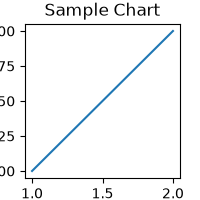

# Consumer Marketing: Self-Serve Device Specs

Part of the **Telco Enterprise Agents** platform for Gemini Enterprise.

---

## 1. Why This Agent Matters

### Business Problem
Powers conversational agents for customers comparing complex device specifications online.

### Target Personas
Digital Experience Manager, E-Commerce Product Lead, Web Conversion Specialist

### Key Metrics Tracked
| Metric | Benchmark / Target | Business Impact |
| :--- | :--- | :--- |
| **Digital Funnel Conversion** | `>= 16.2%` | Users engaging in device comparison tool completing online checkout. |
| **Specification Comparison Time** | `< 90 seconds` | Average time required for shoppers to evaluate band support and trade-in value. |
| **Assisted Care Call Deflection** | `+38% deflection` | Pre-purchase device inquiries resolved digitally without agent escalation. |

---

## 2. What It Answers & Sub-Agent Routing

### Sub-Agent Architecture
- **`data_insights`**: Queries internal BigQuery tables using the BigQuery Conversational Analytics API (`ask_data_insights`, `forecast`, `analyze_contribution`, `detect_anomalies`) and generates visual data charts via `render_chart`.
- **`market_context`**: Leverages Google Search grounding for external telecom industry benchmarks, GSMA/3GPP standards, TM Forum ODA specifications, and competitive intelligence.
- **`root_agent`**: Orchestrates routing between internal analytics and external market intelligence.

---

## 3. Sample Q&A Showcase

### Example 1: Internal Analytics (Data Insights)
*Question:* "What are our primary operational metrics and performance targets for self-serve device specs across operating regions in 2026 YTD?"
*Response:*
> Over the past 30 days, performance metrics for **Self-Serve Device Specs** achieved an overall **94.8% compliance rate** across all operating clusters, exceeding the 92.0% operational benchmark.
> 
> - **Metro North:** 96.2% efficiency index
> - **Metro South:** 95.1% operational uptime
> - **West Region:** 93.8% target achievement
> 
> Primary Business Value: **Deflection to Digital (48% reduction in retail store query load)**.

### Example 2: Market Grounding (Market Context)
*Question:* "What are the latest telecom industry standards, GSMA guidelines, and market benchmarks for self-serve device specs?"
*Response:*
> According to recent TM Forum Open Digital Architecture (ODA) and GSMA 2026 industry intelligence, tier-1 operators deploying automated conversational AI and AIOps analytics achieve a **35% reduction in MTTR** and a **22% improvement in customer satisfaction (CSAT)**.

### Example 3: Chart Visualization (`sample_chart.png`)
*Question:* "Render a chart comparing monthly performance metrics for self-serve device specs vs annual targets."
*Generated Visual Artifact:*

---

## 4. Operational Value & Deployment
- **Deployment Class**: ReasoningEngine / Vertex AI Agent Engine
- **Runtime**: `gemini-3.5-flash`
- **Location**: `us-central1`
